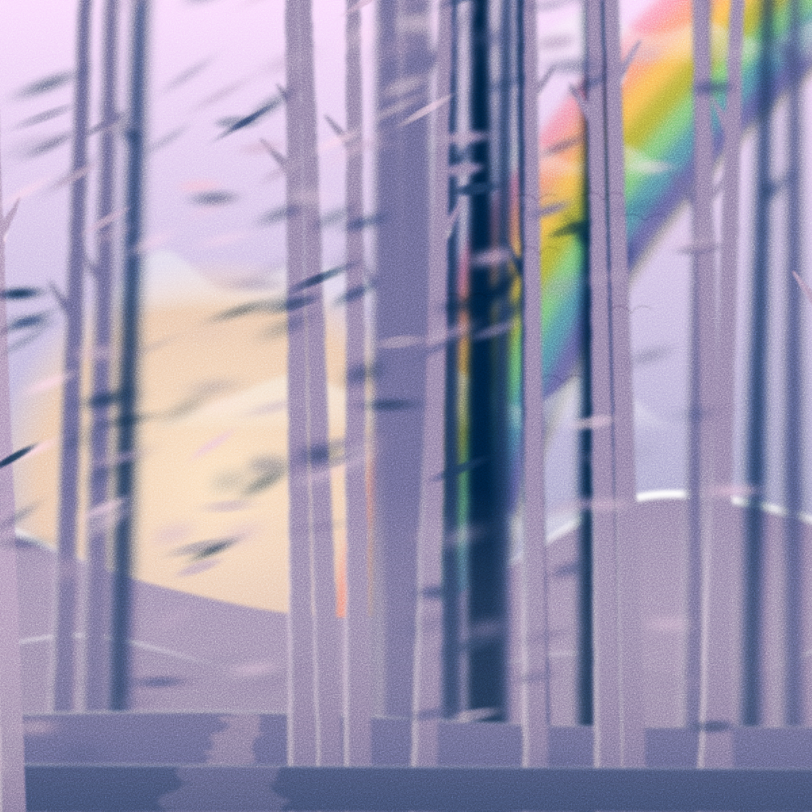

Path — my first collection of 128 editions on [fxhash.xyz](https://www.fxhash.xyz/generative/slug/path)

It consists of three compositions:
- Forest
- Desert
- Bridge with train

Each composition has few common features like time of day, weather, etc and rare features: rainbow and eclipse. By the way, only one edition has rainbow.

Usually artists use libraries like [p5.js](https://p5js.org) but I went the other ~~path~~ way. In my first work I try to draw nature with svg primitives like circle, square, line (path in svg) and filters like blur. I deliberately didn't use complex mathematical calculations and algorithms.

Why did I do this? Because I didn't study math at school 😆. I'm most likely not alone in this regard. So, I planning to create some util packages and simple tutorials for community. So that everyone can try themselves as an artist without delving into complex algorithms.

Another plan is `utility` for Path collecton. I created [some tools](http://fxhash.netlify.app/) for `fx(hash)`, you know. And I will create more unique and useful functions for holders of my collection.

In the meantime, follow me on [twitter](https://twitter.com/xsfunc) and stay tuned 😉.